<div align="center">
  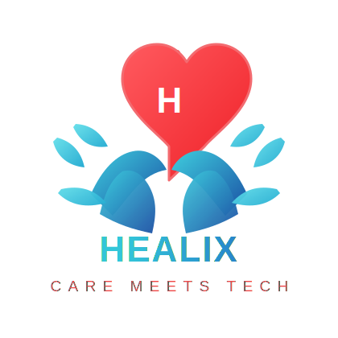
</div>

---

[](https://git.io/typing-svg)

---

# Healix: Revolutionizing Healthcare with AI-Powered Solutions 🚀💊

   

Welcome to **Healix!** Our mission is to make healthcare management seamless, efficient, and more accessible. By integrating advanced technologies—like AI-driven chatbots, predictive analytics, and secure cloud services—Healix brings together everything you need for a comprehensive healthcare experience.

---

## Table of Contents 📚

1. [Overview](#overview)
2. [Problem Statement and Motivation](#problem-statement-and-motivation)
3. [Features](#features)
   1. [Medicine Reminder](#medicine-reminder)
   2. [MediChat AI Doctor](#medichat-ai-doctor)
   3. [Medicine Price Comparison](#medicine-price-comparison)
   4. [Insurance Premium Predictor](#insurance-premium-predictor)
   5. [Healthcare Services Finder](#healthcare-services-finder)
   6. [Secure Login](#secure-login)
   7. [Health Records Management](#health-records-management)
   8. [Easy Appointments](#easy-appointments)
4. [Architecture & Key Components](#architecture--key-components)
   1. [Corrective Retrieval-Augmented Generation (RAG)](#corrective-retrieval-augmented-generation-rag)
   2. [Medicine Reminders with Cron Jobs](#medicine-reminders-with-cron-jobs)
   3. [Appointments via NexHealth](#appointments-via-nexhealth)
   4. [Medicine Price Comparison Scraper](#medicine-price-comparison-scraper)
   5. [Insurance Premium Predictor](#insurance-premium-predictor-1)
5. [Technologies Used](#technologies-used)
6. [Installation](#installation)
7. [Usage](#usage)
8. [Environment Variables](#environment-variables)
9. [Service Account Key](#service-account-key)
10. [API Reference](#api-reference)
11. [Meet the Team](#meet-the-team)
12. [Contributing](#contributing)
13. [License](#license)

---

## Overview 🌟

<<<<<<< HEAD
**Healix** unifies essential healthcare services under one digital roof. From AI-guided consultations to medication price comparison and an intelligent appointment-scheduling system, Healix empowers users to make informed decisions about their health.

- -
=======
>>>>>>> 7c3673dff110babe7debb921e2d2748071d90c6d

---

## Problem Statement and Motivation 💡

When thinking about healthcare, several guiding questions arise: How can we provide patients with seamless access to their health records? How can we simplify the process of locating nearby hospitals and scheduling appointments? These questions lie at the core of creating a comprehensive Healthcare Management System.

Healthcare management is often seen as a challenging and fragmented process, but technology can transform it into a cohesive and efficient experience. By integrating features like hospital locators, health data storage, appointment scheduling, and secure access to medical records, we can bridge gaps in patient care and hospital management.

For instance, a hospital locator powered by real-time APIs can help patients in emergencies quickly find nearby facilities. Similarly, a robust health data storage system ensures that users have their medical history accessible anytime, anywhere, reducing delays in treatment. Appointment scheduling features can streamline booking consultations, allowing both patients and healthcare providers to focus on care delivery rather than administrative tasks.

By enabling data aggregation from multiple healthcare providers using advanced APIs, we can provide a centralized view of a patient’s health journey, enhancing decision-making for both patients and providers. Leveraging modern frameworks, tools, and technologies like scalable relational databases (Supabase) and Large Language Models (LLMs) integrated with corrective Retrieval-Augmented Generation (RAG) ensures smarter, more interactive systems for exceptional user experiences.

---

## Features ✨

### 1. Medicine Reminder 💊

- **Description:** Never miss a dose with our smart medicine reminder system.
- **Technology:** Uses Firebase Cloud Messaging (FCM) for real-time notifications and cron job schedulers for timely reminders.
- **Benefit:** Helps users stay on track with their medication schedules while handling timezone differences.

### 2. MediChat AI Doctor 🤖

- **Description:** Experience personalized healthcare guidance with our AI-powered chat system.
- **Technology:** Leveraging **Corrective Retrieval-Augmented Generation (RAG)** integrated with Pinecone for similarity search and real-time feedback loops to ensure high response accuracy.
- **Benefit:** Accurate consultations enriched by relevant patient health records and external authoritative medical information.

### 3. Medicine Price Comparison 🏷️

- **Description:** Easily compare medicine prices across top online pharmacies like PharmEasy, 1mg, and Apollo Pharmacy.
- **Benefit:** Save money by getting the best available deals on your medications through real-time data scraping.

### 4. Insurance Premium Predictor 📊

- **Description:** Predict your insurance premium costs using advanced machine learning models deployed through ONNX.
- **Benefit:** Accurate and real-time predictions based on health and demographic data, aiding users in making informed financial decisions.

### 5. Healthcare Services Finder 📍

- **Description:** Discover local specialists, clinics, labs, and other healthcare facilities with real-time geo-location.
- **Benefit:** Compare services and read verified reviews from other patients.

### 6. Secure Login 🔒

- **Description:** Protect your account with enterprise-grade security.
- **Features:** Multi-factor authentication and end-to-end encryption ensure user data privacy.

### 7. Health Records Management 🗂️

- **Description:** Consolidate all medical records—including test results and prescriptions—within a secure vault.
- **Benefit:** Hassle-free sharing with healthcare providers for timely and accurate treatment.

### 8. Easy Appointments 🗓️

- **Description:** Book, reschedule, or cancel appointments seamlessly.
- **Technology:** Integrated with **NexHealth** for real-time scheduling and reminders.
- **Benefit:** Centralized dashboard for all your medical visits, making the process stress-free.

---

## Architecture & Key Components 🛠️

### Corrective Retrieval-Augmented Generation (RAG)

1. **User Query & Health Records**: Relevant portions of user health records and queries are embedded into a vector store (e.g., Pinecone).
2. **Contextual Retrieval**: Searches for closely matching documents in the vector store based on the query embedding.
3. **Response Generation**: Combines query, documents, and health records for LLM (Language Learning Model) processing, ensuring accurate natural language responses.
4. **Feedback Loop**: Incorrect or incomplete responses trigger interactions with a Health Information Search API to refine the result.

### Medicine Reminders with Cron Jobs

- **Node.js cron** tasks run every minute to check for due reminders.
- **Firebase Admin SDK** sends push notifications to user devices.
- **Robust Error Handling:** Ensures seamless operation by handling timezone differences and retries.

### Appointments via NexHealth

- **NexHealth API**: Used for provider lookup, patient records, and appointment scheduling.
- **Express.js Backend**: Synchronizes appointments with Supabase for a unified experience.

### Medicine Price Comparison Scraper

- **Real-Time Scraping**: Fetches live medicine prices from multiple platforms.
- **JSON Aggregation**: Standardizes data across different APIs for easy comparison.

### Insurance Premium Predictor

- **Machine Learning Models**: LightGBM, Random Forest, and others are converted to ONNX for efficient deployment.
- **ONNX Pipelines**: Standardizes preprocessing and prediction, ensuring real-time, scalable predictions.

---

## Technologies Used 💻

<div align="center" style="display: flex; gap: 10px;">
  
  
  
  
  
  
</div>

---

## Installation 🛠️

```bash
# Clone the repository
git clone

# Navigate to the project directory
cd curo-frontend

# Install Dependencies
npm install

# Start the frontend
npm run dev

# Go to the backend
cd ..
cd backend

# Start the backend
npm run dev
```

---

## Usage 📋

1. **Dashboard**: After signing in, manage:
   - **Medicine Reminders**
   - **MediChat AI Doctor**
   - **Insurance Premium Predictions**
   - **Appointment Bookings**

2. **Notifications**: Allow notifications to receive real-time alerts about medication schedules and appointments.

3. **User Profile**: Update personal details, health information, and preferences.

---

## Environment Variables ⚙️

Create a `.env` file in the **root** of your **backend** directory and add the following variables (replace placeholders with your real credentials):

```bash
PORT=3000

FIREBASE_API_KEY=""
FIREBASE_AUTH_DOMAIN=""
FIREBASE_PROJECT_ID=""
FIREBASE_STORAGE_BUCKET=""
FIREBASE_MESSAGING_SENDER_ID=""
FIREBASE_APP_ID=""

SUPABASE_URL=""
SUPABASE_SERVICE_KEY=""

GOOGLE_MAPS_API_KEY=""
PINECONE_API_KEY=""
PINECONE_INDEX=""
GROQ_API_KEY=""
TAVILY_API_KEY=""
NEXHEALTH_API_KEY=""
NEXHEALTH_SUBDOMAIN=""
NEXHEALTH_LOCATION_ID=""
```

---

## Service Account Key 🔑

For **Firebase Admin SDK** (if applicable), create a file named `serviceAccountKey.json` in the **backend** directory and populate it with your service account credentials:

```json
{
  "type": "",
  "project_id": "",
  "private_key_id": "",
  "private_key": "----",
  "client_email": "",
  "client_id": "",
  "auth_uri": "",
  "token_uri": "",
  "auth_provider_x509_cert_url": "",
  "client_x509_cert_url": ""
}
```

---

## API Reference 🔗

Comprehensive API documentation is available in our [Postman Collection](#). Below are some commonly used endpoints:

### Medicine Reminder 💊

- **POST** `/api/medicine-reminder` — Create a new reminder
- **GET** `/api/medicine-reminder` — Get all reminders
- **PUT** `/api/medicine-reminder/:id` — Update a reminder
- **DELETE** `/api/medicine-reminder/:id` — Delete a reminder

### MediChat AI Doctor 🤖

- **POST** `/medi-chat` — Submit your health question for AI-driven guidance

### Insurance Premium Predictor 📊

- **POST** `/premium-predictor/predict` — Get insurance premium estimates

### NexHealth Appointments 🗓️

- **POST** `/book` — Book a new appointment
- **GET** `/slots` — Check available time slots

### Healthcare Services Finder 📍

- **GET** `/api/maps/nearby-hospitals` — Find nearby hospitals
- **GET** `/api/maps/nearby-pharmacy` — Locate pharmacies within a specified radius

## For the full list of endpoints and parameters, check the [Postman Docs](#).

## Screenshots 📸

### Landing Page


### Auth Page

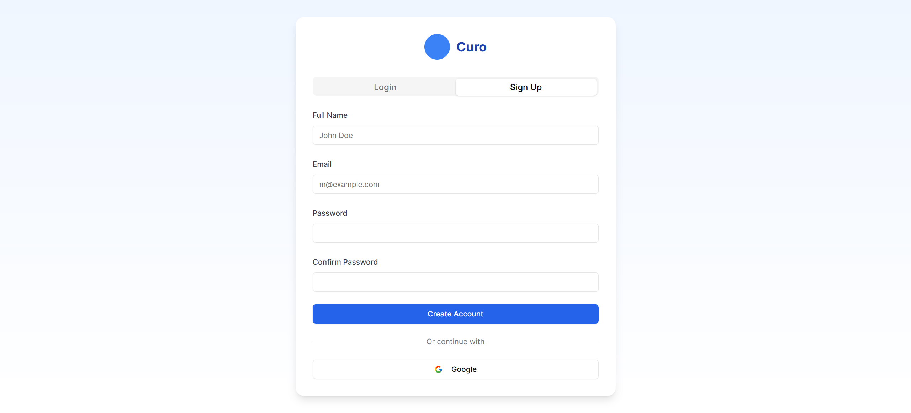

### Dashboard

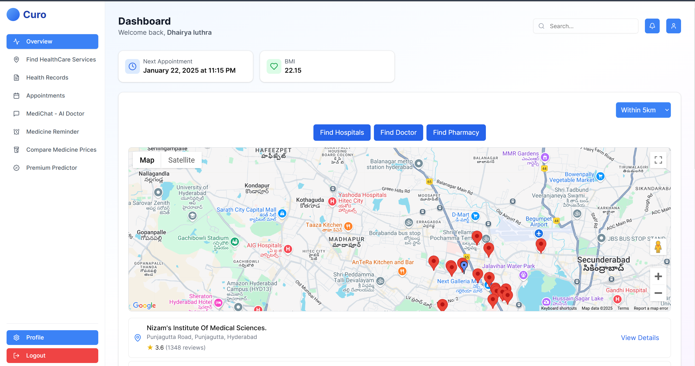

### Find Nearby Services

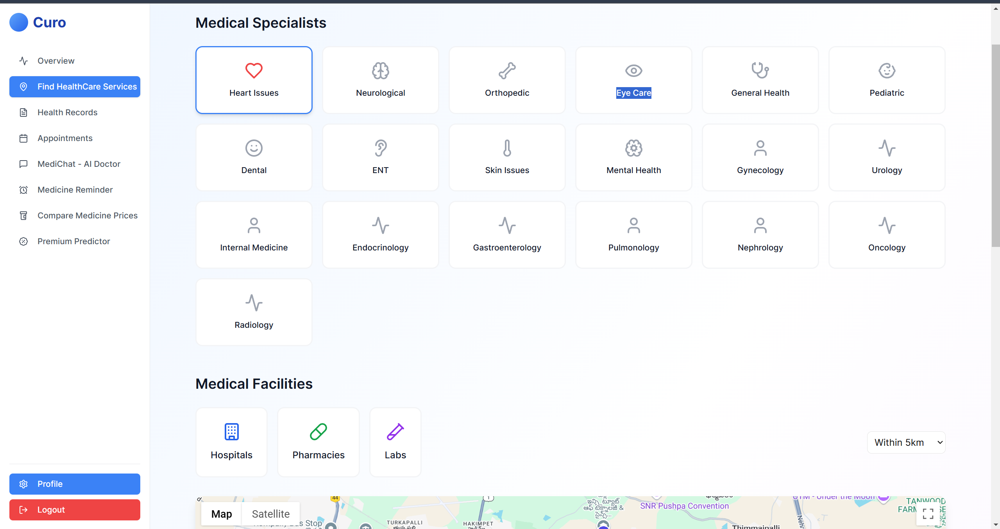
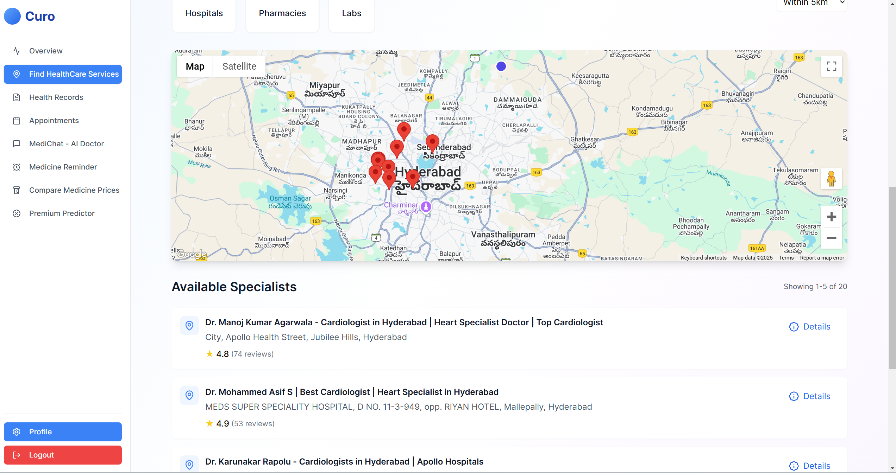

### Appointments

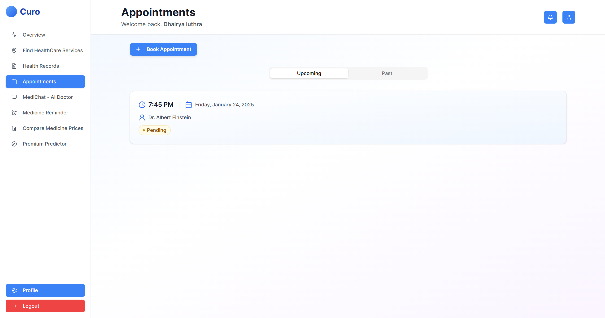

### Health Records

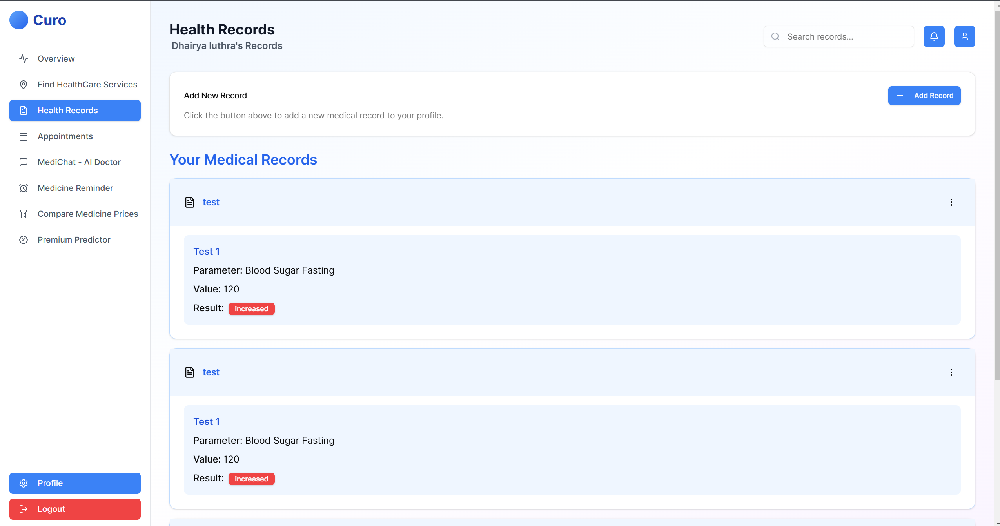

### Medichat - AI Doctor

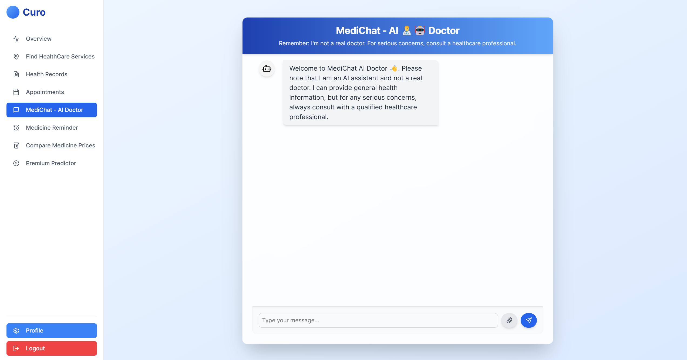

### Medicine Reminder

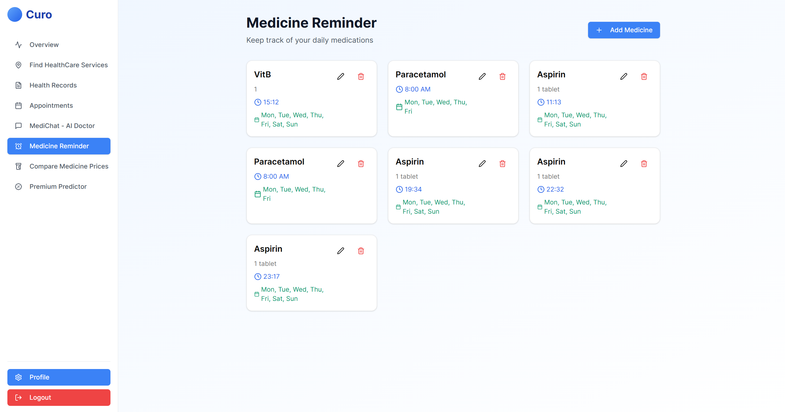

### Medicine Price Comparison

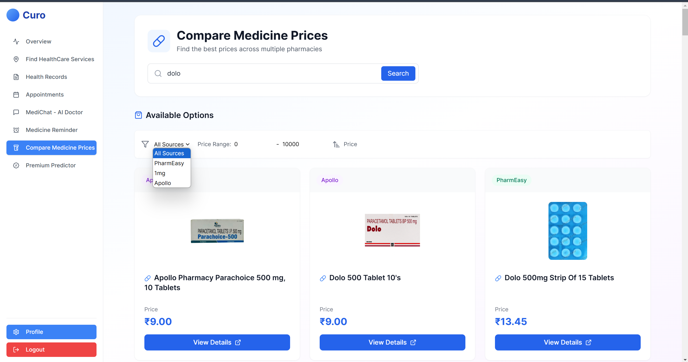

### Premium Predictor

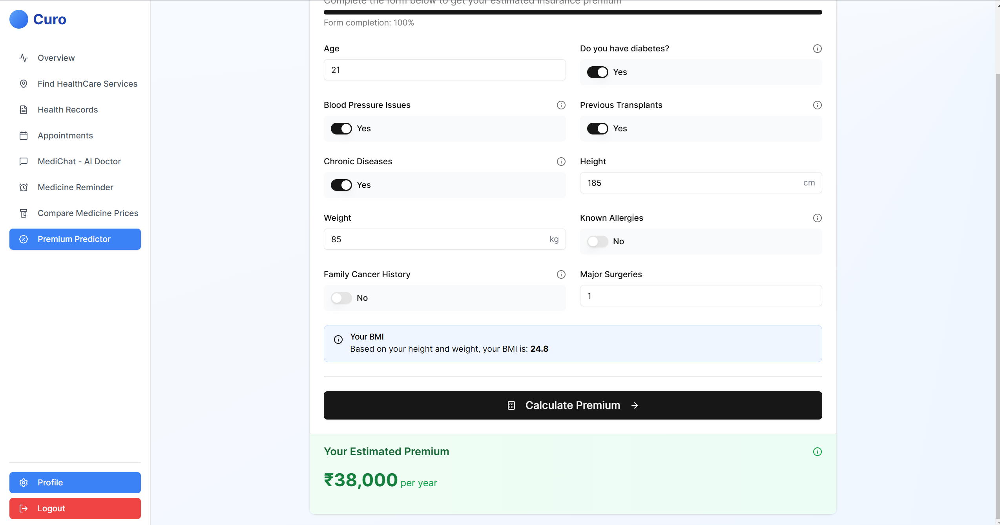

### User Details

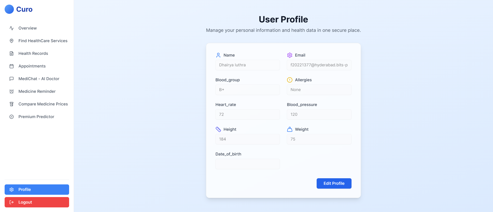

---

---

## License 📜

This project is released under the [MIT License](#). You are free to use, modify, and distribute this software within the license terms.
